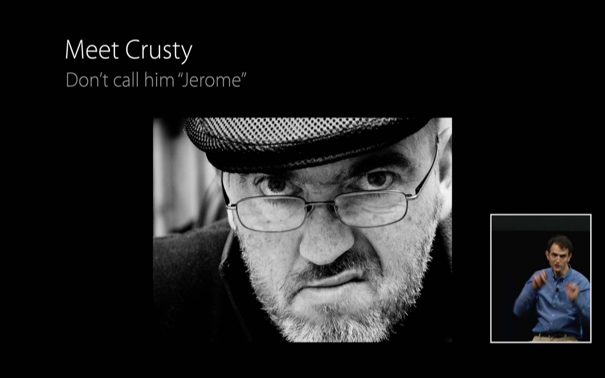

build-lists: true

# _**Niels van Hoorn**_
### @nvh

- _iOS developer_ NRC 📰
- _Organizer_ CocoaHeads ☕️
- _Creator_ Forens 🚅

---
## _**Protocol-Oriented**_ DataSources
# 🐦

---
# 💭
## Remember _Crusty_?

---

Protocol-Oriented Programming in Swift *(WWDC 2015 - Session 408)*

---

#  🐛
## Let's try _**Playgrounds**_

---

#  😇
## Let's _**forgive**_  XCode

---

# 😳⁉️  💬

---

# 🤔🐞 🗣

---

# 🎬
# 🔫😎🍸
# 🇬🇧👔💃
